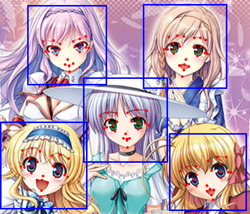

# Anime face landmark detection by deep cascaded regression
This is an implementation of deep cascaded regression for anime face landmark detection on Pytorch.

Original Github Address: https://github.com/kanosawa/anime_face_landmark_detection 



## Dependencies
- Python3.7
- Pytorch==1.3
- opencv-python
- PIL
- try `pip install -r requirements.txt` to install dependencies

## Downloads (Already Done)

Download the checkpoint file from [google_drive](https://drive.google.com/open?id=1NckKw7elDjQTllRxttO87WY7cnQwdMqz) and cascade file for face detection from [nagadomi/lbpcascade_animeface](https://github.com/nagadomi/lbpcascade_animeface)

```
wget https://raw.githubusercontent.com/nagadomi/lbpcascade_animeface/master/lbpcascade_animeface.xml
```

## Usage

execute `python example_robust.py --help` for help

+ -i: input directory

+ -o: output directory

+ -c: whether half-crop the image

+ -d: whether detect faces

+ -s: whether show the order of landmarks

+ Sample:

  ```
  python example_robust.py -i input_dir -o output_dir -c y -d y -s y
  ```

  + The directory structure of input_dir will be inheritted into the output_dir

    

  + Image before:

    

  + Image after:

    